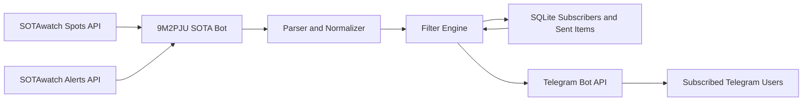

# 9M2PJU SOTA Bot

`9M2PJU SOTA Bot` is a Telegram bot for SOTA chasers and activators. It follows SOTAwatch spots and alerts, then delivers useful updates to Telegram users who subscribe to the bot.

Use the bot on Telegram: [@PJUSOTA_bot](https://t.me/PJUSOTA_bot)

## What Is SOTA?

Summits on the Air, commonly known as SOTA, is an amateur radio award programme that encourages portable operation from mountain summits. Activators hike or travel to qualified summits and operate radio from the field, while chasers contact them from home stations, portable stations, or other summits.

SOTAwatch is the main place where the SOTA community shares live activity:

- Spots show activators who are currently on air.
- Alerts show planned activations before they happen.
- Callsigns, summit references, frequencies, modes, and comments help chasers find activators quickly.

## Why This Bot Exists

SOTAwatch is excellent, but Telegram notifications are more convenient when you are away from a browser, monitoring mobile, or only interested in selected activity. This bot acts as a lightweight bridge between SOTAwatch and Telegram.

The goal is simple: send relevant SOTA spots and alerts to people who ask for them, while avoiding repeated notifications and unnecessary noise.

## How The Bot Works

The bot polls public SOTAwatch JSON feeds for spots and alerts. It stores Telegram subscriber preferences in SQLite, checks each new SOTA item against the subscriber filters, and sends matching messages through Telegram.

## Main Features

- Monitors latest SOTA spots.
- Monitors upcoming SOTA alerts.
- Sends Telegram notifications to subscribed users.
- Supports filters by association, callsign, and mode.
- Stores subscribers and deduplication state in SQLite.
- Avoids resending the same spot or alert to the same chat.
- Runs as a lightweight Docker container suitable for Raspberry Pi.

## Telegram Commands

- `/start` - subscribe and show help.
- `/help` - show command help.
- `/subscribe` - enable notifications.
- `/unsubscribe` - stop all notifications.
- `/spots_on` - enable spot notifications.
- `/spots_off` - disable spot notifications.
- `/alerts_on` - enable alert notifications.
- `/alerts_off` - disable alert notifications.
- `/spots` - show latest matching spots.
- `/alerts` - show upcoming matching alerts.
- `/filter` - show active filters.
- `/filter 9M2` - follow one SOTA association prefix.
- `/filter 9M6` - follow one SOTA association prefix.
- `/filter callsign 9M2PJU` - follow a callsign.
- `/filter mode CW` - follow a mode.
- `/clearfilters` - remove all filters.

Filters are matched case-insensitively. Association filters match SOTA association prefixes such as `9M`, `W4C`, `JA`, or `VK3`. Callsign filters match activator, poster, and spotter callsigns.

## Technology Used

- Python 3.12
- python-telegram-bot
- SOTAwatch public JSON feeds
- SQLite
- Docker Compose
- Alpine Linux Docker base image

## Data Sources

- SOTAwatch website: `https://sotawatch.sota.org.uk/en/`
- Spots feed: `https://api2.sota.org.uk/api/spots/-1/all`
- Alerts feed: `https://api2.sota.org.uk/api/alerts`

## Project Notes

The bot is designed to be small, readable, and reliable. It keeps user preferences local, treats SOTAwatch as the source of truth, and uses Telegram only for interaction and delivery.

## License

This project is licensed under the GNU General Public License v3.0 or later. See [LICENSE](LICENSE) for details.
